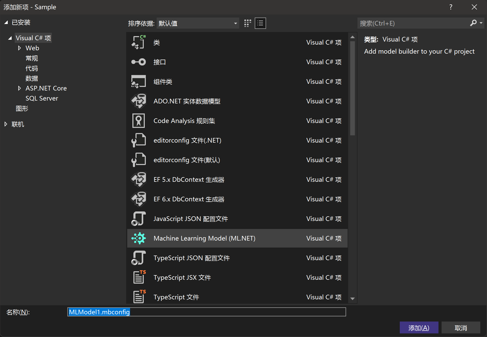
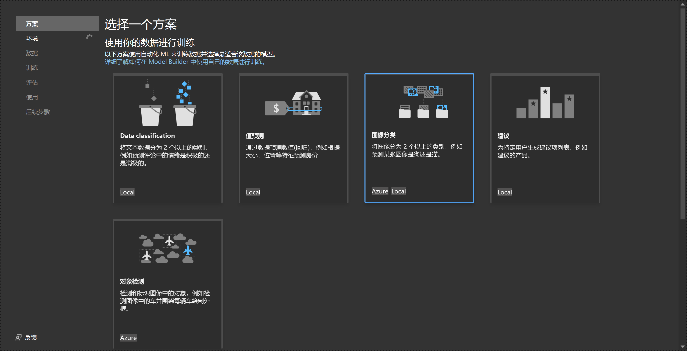
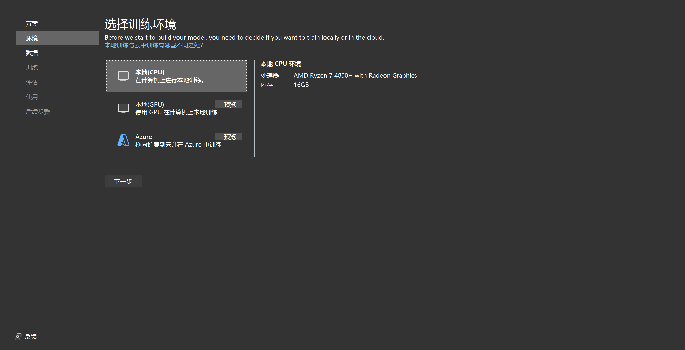
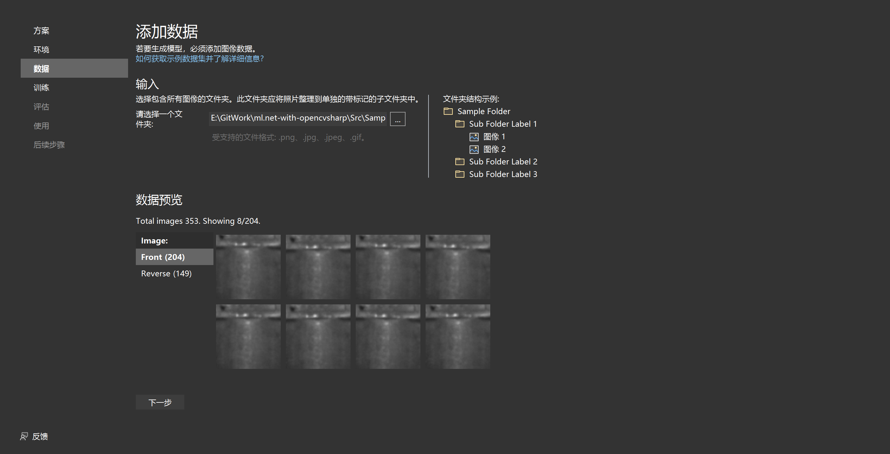
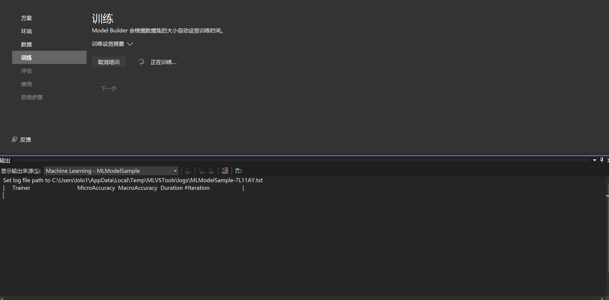
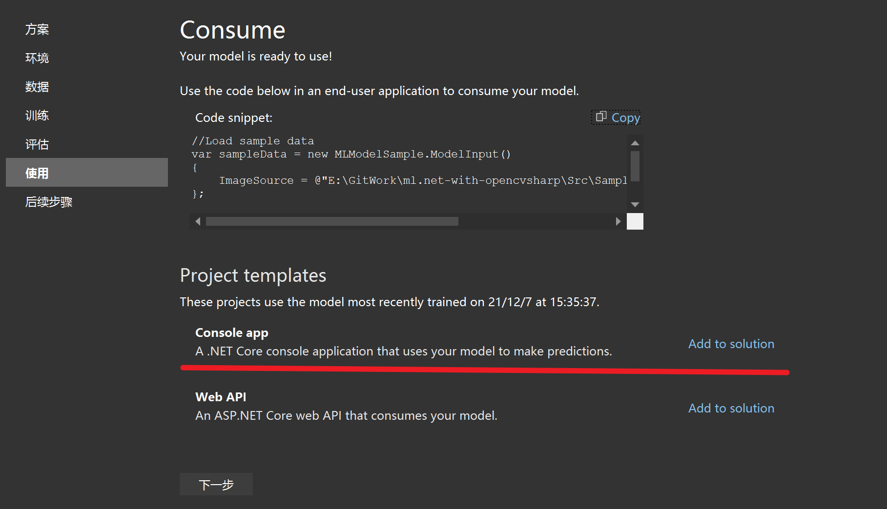
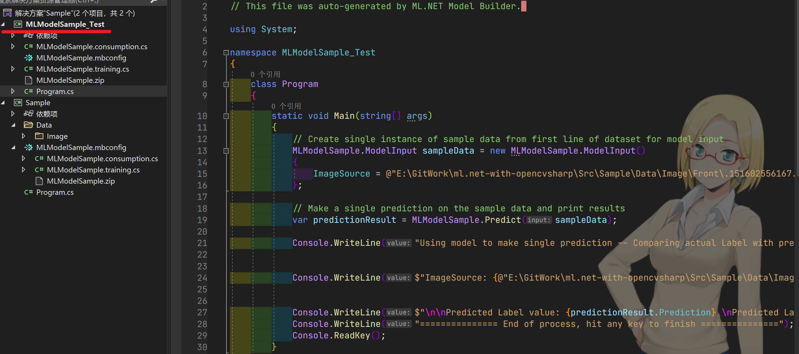

## 是什么？
这是一个ml.net的示例项目；
另外包括了如何结合OpencvSharp的Mat对象作为输入进行图像预测

## 引用
|功能|引用包|
|--|--|
|OpencvSharp|[OpencvSharp](https://github.com/shimat/opencvsharp_samples)|
|ML.Net|[ML.Net](https://github.com/dotnet/machinelearning-modelbuilder)|

## 推荐
>交流讨论QQ群:827888895  
其它项目： 
[OpenCVSharpHelper](https://gitee.com/tfarcraw/opencvsharphelper)
[OpenCvVision](https://gitee.com/lolo77/OpenCVVision)

## ML.Net流程说明
### 一、关于ML.Net的创建、训练较简单，见下图：（对应解决方案中Sample项目、MLModelSample_Test项目）
#### 1.添加MLModel文件

#### 2.选择图像分类方案

#### 3.选择训练环境

#### 4.选择图像文件（绝对路径，测试请重新选择）

#### 5.开始训练


#### 6.训练完成
训练完成之后，可以查看自动生成的文件目录，
包括了：

* MLModelSample.consumption.cs  模型消费相关的函数，即加载模型，进行图形预测；
* MLModelSample.training.cs  模型重训练
* MLModelSample.zip 模型训练的结果；

#### 7.图形预测（MLModelSample_Test项目）
这里选择添加一个新的控制台项目，进行模型的消费示例；
运行项目，即可看到预测的结果；
当第一次进行预测时，需要加载模型，所以时间偏长，实际使用时可以预先加载好模型，后续使用时直接进行预测。



### 二、从mat载入进行图像预测（对应解决方案中Sample.OpenCv项目）
默认的示例只支持从本地读取文件进行图像的预测，为了在项目中结合OpenCvSharp的mat进行直接预测使用，需要做以下处理：
#### 1.处理训练数据
本来训练时，是将所有的图像路径作为`ImageSource`与所在文件夹名字作为 `Label`作为输入数据，并且这个工作自动完成；
现在我们需要直接输入图像byte[]，需要将输入数据进行以下处理：

* 创建新的`ModelInput`，这里命名为`ModelInputBytes`
  ```c#
  public class ModelInputBytes
  {
  	[ColumnName(@"Label")]
  	public string Label { get; set; }        
  	[ColumnName(@"Features")]
  	public byte[] ImageSource { get; set; }
  }
  ```
  新建一个方法，将图像转换成byte[]
  ```c#
  //将本地的图像转换为byte[]，以进行重新训练
  //重新训练后，在使用mat进行图像预测时，调用mat.ToBytes()作为输入进行预测即可
  private static byte[] GetMatBytes(string imagePath)
  {
	var mat = Cv2.ImRead(imagePath, ImreadModes.Grayscale);
	var vs = mat.ToBytes();
	return vs;
  }
  ```
  将原来本地文件夹里的图像文件，转换成新的数据样本，以便后续进行训练
  ```c#
  //读取原来的样本图像，转换为新的模型输入类型集合
  var input1 = Directory.GetFiles("/Img/Front/").Select(f => new ModelInputBytes() { Label = "Front", 
                    ImageSource = GetMatBytes(f)}).ToList();
  var input2 = Directory.GetFiles("/Img/Reverse").Select(f => new ModelInputBytes() { Label = "Reverse", 						ImageSource = GetMatBytes(f)}).ToList();
  input1.AddRange(input2);
  //从集合加载，生成新的数据样本
  IDataView newData = mlContext.Data.LoadFromEnumerable<ModelInputBytes>(input1);
  ```
  
  

#### 2.重新训练

由于输出样本类型发生改变，我们需要在原来基础上进行重新训练。在原来的训练方法基础上做修改：

* 配置重新训练方法，对比原来给出的训练方法，去掉从本地加载图片；由于新的`ModelInput`将`ImageSource`标记为`Features`，可以更简洁

  ```c#
  //更改trainData类型，并调用该方法重新训练
  public static ITransformer RetrainPipelineBytes(MLContext context, IDataView trainData)
  {
  	var trainingPipeline = context.Transforms.Conversion.MapValueToKey(@"Label", @"Label")                                  .Append(context.MulticlassClassification.Trainers.ImageClassification(labelColumnName: @"Label"))              .Append(context.Transforms.Conversion.MapKeyToValue(@"PredictedLabel", @"PredictedLabel"));       
  	var model = trainingPipeline.Fit(trainData);
  	return model;
  }
  //训练完成后，进行新的模型保存
  mlContext.Model.Save(retrainedModel, newData.Schema, "newModel.zip");
  ```

#### 3.重写预测方法

为了方便使用，我们将加载模型分离开来，在加载初始化模型之后，在进行预测：

* 初始化模型

  ```c#
  public static void CreatePredictEngineBytes(string MLNetModelPathBytes)
  {
  	MLContext mlContext = new MLContext();
  	ITransformer mlModel = mlContext.Model.Load(MLNetModelPathBytes, out var modelInputSchema);
  	_predEngineBytes = mlContext.Model.CreatePredictionEngine<ModelInputBytes, ModelOutput>(mlModel);
  }
  ```

* 进行预测

  ```c#
  private static ModelOutput PredictFromBytes(ModelInputBytes input)
  {
  	ModelOutput result = _predEngineBytes.Predict(input);
  	return result;
  }
  ```

#### 4.进行使用

详细请参照Sample.Opencv项目；

将上面3个过程整合到`MLModelHelp.cs`文件中，方便进行训练、加载模型、预测（mat），并以Public方法供调用；